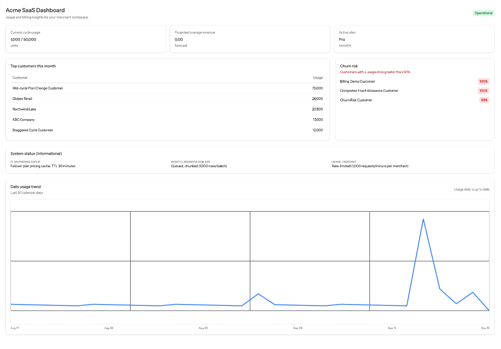

# Meterly

Meterly is a Laravel subscription billing and usage-metering application for
multi-tenant merchants. It records high-volume usage events, asynchronously
builds daily usage aggregates, calculates subscription billing, generates
invoices, and exposes merchant dashboard insights.



## AI-assisted development prompts

The prompts used during AI-assisted implementation and review are recorded in
the [`prompts/`](prompts/) folder.

## Requirements

- PHP 8.3 or newer
- Composer
- Node.js and npm for frontend assets
- SQLite for local development, or another Laravel-supported database
- A shared cache store for multi-server deployments
- A queue worker for aggregation and invoice jobs
- A continuously running Laravel scheduler for due-invoice discovery

The default local configuration uses:

```dotenv
DB_CONNECTION=sqlite
QUEUE_CONNECTION=database
CACHE_STORE=database
```

Redis is recommended for production queue uniqueness, scheduler locks, and
shared plan-pricing cache access.

## Installation

```bash
composer install
cp .env.example .env
php artisan key:generate
touch database/database.sqlite
php artisan migrate --seed
npm install
npm run build
```

Configure `DB_*`, `QUEUE_CONNECTION`, `DB_QUEUE_RETRY_AFTER`, `CACHE_STORE`,
`CACHE_PREFIX`, and Redis or database credentials in `.env` as appropriate for
the environment.

## Running the application

Start the Laravel application using the project's normal development command:

```bash
composer run dev
```

Alternatively, run the application and frontend processes separately using the
standard Laravel and Vite commands.

## Queue and scheduler processes

Start a queue worker:

```bash
php artisan queue:work --tries=3 --timeout=120
```

Start the scheduler:

```bash
php artisan schedule:work
```

The queue reservation window should remain longer than the job timeout:

```dotenv
DB_QUEUE_RETRY_AFTER=180
```

The scheduled `billing:generate-invoices` command runs daily at 00:05,
discovers completed subscription periods in chunks, and dispatches unique
invoice jobs. Aggregation is also queued and can be dispatched for a date
range with:

```php
AggregateDailyUsageJob::dispatch('2026-09-01', '2026-09-15', $merchantId);
```

Both aggregation and invoice jobs retry three times with progressive backoff
and are safe to execute more than once.

## API

All merchant API requests require an authenticated, verified user belonging to
the merchant. The application currently uses Laravel's web authentication
middleware.

### Record usage

```http
POST /usage
Content-Type: application/json
```

```json
{
    "merchant_id": 1,
    "customer_id": 501,
    "subscription_period_id": 9001,
    "event_key": "evt_abc123",
    "usage_date": "2026-09-13",
    "units": 250
}
```

Successful creation returns HTTP 201:

```json
{
    "message": "Usage recorded successfully",
    "event_id": "evt_abc123"
}
```

Retrying the same `event_key` for the merchant returns HTTP 200 without
creating or counting a second event:

```json
{
    "message": "Usage event already recorded",
    "event_id": "evt_abc123"
}
```

The endpoint is authenticated, validated, merchant-scoped, and rate-limited.

### Merchant dashboard

```http
GET /merchants/{merchant}/dashboard
Accept: application/json
```

The response includes the active plan, current-cycle usage versus allowance,
informational aggregation status, top five customers, projected overage
revenue, churn-risk customers, and exactly 30 daily trend points:

```json
{
    "active_plan": {
        "name": "Growth",
        "billing_cycle": "monthly",
        "included_units": 50000,
        "current_period_start": "2026-09-01",
        "current_period_end": "2026-09-30",
        "current_cycle_usage": {
            "units": 32500,
            "allowance": 50000,
            "percentage": 65
        }
    },
    "system_status": {
        "status": "operational",
        "message": "Usage data is up to date",
        "aggregation_up_to_date": true
    },
    "top_customers": [
        {
            "customer_id": 501,
            "name": "Customer A",
            "usage": 125000
        }
    ],
    "projected_overage_revenue": 4250,
    "churn_risk_customers": [
        {
            "customer_id": 502,
            "name": "Customer B",
            "previous_month_usage": 100000,
            "current_month_usage": 45000,
            "drop_percentage": 55
        }
    ],
    "usage_trend": [
        {
            "date": "2026-08-17",
            "units": 0
        },
        {
            "date": "2026-08-18",
            "units": 1840
        }
    ]
}
```

## Architecture and data flow

```text
Merchant
  -> Plans
  -> Customers
  -> Subscriptions
  -> Subscription periods (pricing snapshots)
  -> Usage events (source of truth)
       -> AggregateDailyUsageJob
       -> usage_daily (dashboard and billing read model)
            -> DashboardService
            -> BillingCalculationService
                 -> GenerateInvoiceService
                 -> Invoices and invoice items
```

Raw events remain append-oriented and auditable. Dashboard and billing reads
use `usage_daily` to avoid scanning the raw event table synchronously.

## Important assumptions

1. Billing periods are subscription-specific and can differ from calendar
   months.
2. A completed subscription period is invoiced by the daily scheduled command.
3. Raw usage events are the source of truth; `usage_daily` is an eventually
   consistent read model.
4. The dashboard uses average daily usage so far to forecast usage through the
   end of each current subscription-period segment.
5. Proration uses inclusive actual calendar days:
   `active_days = end - start + 1`.
6. Plan changes create separate subscription periods with pricing snapshots.
7. Previous-month usage of zero produces no churn signal because a percentage
   drop cannot be calculated meaningfully.
8. Dashboard system status is informational aggregation metadata, not a full
   infrastructure health-check.
9. Invoice email delivery is separate from invoice creation and is not part of
   the required implementation.

## Scalability strategy

The implementation is designed for 50L+ (5 million+) usage-event rows:

- Usage ingestion uses a tenant-scoped unique event key and indexes on tenant,
  customer, period, and date.
- Aggregation filters by date, groups in the database, and upserts bounded
  chunks into `usage_daily`.
- Dashboard and billing queries read the aggregate table rather than raw
  events.
- Due-period discovery and queue dispatch use `chunkById`.
- Daily aggregate rows are uniquely constrained by merchant, customer, and
  date.
- For substantially larger deployments, partition `usage_events` by
  `usage_date`, archive old raw events, and add reconciliation jobs between
  raw events and aggregates.

## Trade-offs and future improvements

- The dashboard is eventually consistent while aggregation jobs are pending.
- Average-daily-usage forecasting is intentionally simple and deterministic;
  seasonality-aware forecasting could improve projections.
- Database queues and cache stores are convenient defaults; Redis and Horizon
  are better for production monitoring and multi-server throughput.
- Future work could add authorization policies, load testing, query-plan
  benchmarking, invoice PDFs, email delivery, payment integration, and
  stronger metrics and tracing.

## Verification

Run the focused or complete test suite:

```bash
php artisan test --compact
```

Run static analysis and formatting:

```bash
php -d memory_limit=512M vendor/bin/phpstan analyse --memory-limit=512M
vendor/bin/pint --dirty --format agent
```

Inspect operations:

```bash
php artisan route:list
php artisan schedule:list
php artisan migrate:status
```

See [doc/operations.md](doc/operations.md) for worker, scheduler, and cache
operations.
